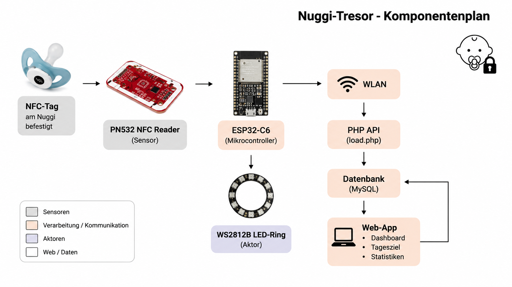
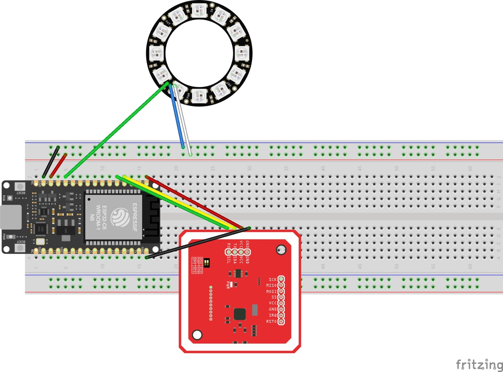
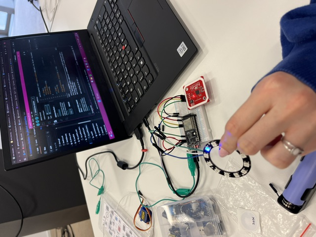
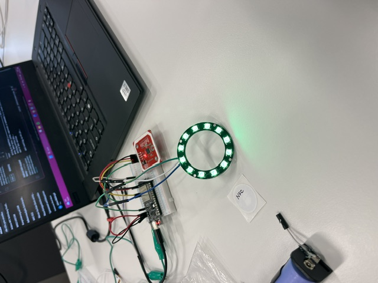
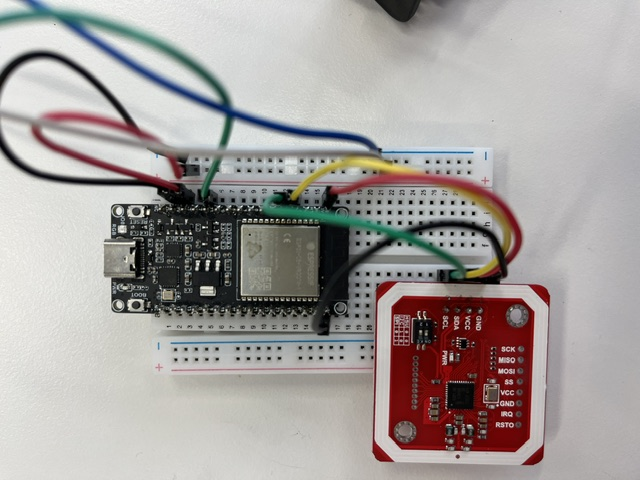
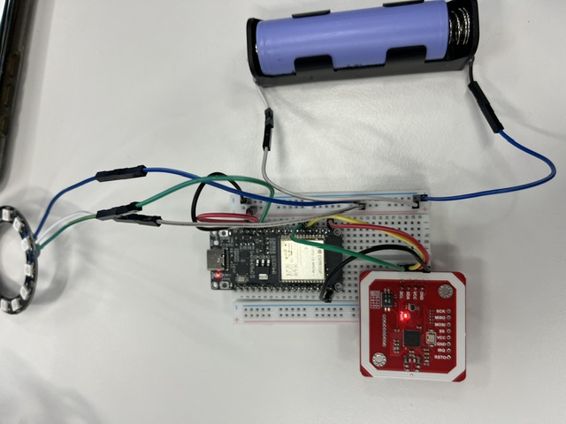
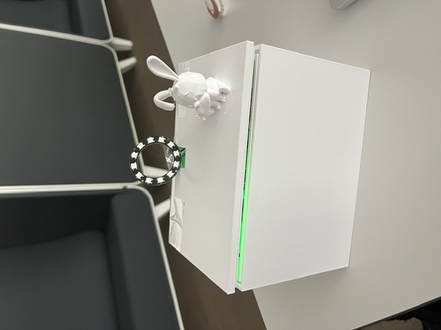

# Nuggi-Tresor


> Der Nuggi-Tresor ist eine smarte Box, die trackt, wie lange ein Kleinkind ohne seinen Nuggi auskommt. Ein ESP32 erkennt per NFC, ob der Nuggi im Tresor liegt, und sendet den Status an eine Web-App. Eltern sehen den Tagesfortschritt in Echtzeit und können ein Tagesziel setzen.

---

## WebApp

### Reproduzierbarkeit

#### 1. Repository klonen

```bash
git clone https://github.com/Lifcz1896/IM4_Nuggitresor.git
```

#### 2. Datenbank anlegen

- Neue MySQL-Datenbank beim Hoster erstellen
- Die Datei `system/db.sql` importieren — sie legt alle nötigen Tabellen an

#### 3. Konfiguration

- `system/config.php.blank` kopieren und in `system/config.php` umbenennen
- Datenbankverbindungsdaten eintragen

#### 4. Dateien hochladen

- FTP-Verbindung mit dem SFTP-Plugin in VS Code herstellen
- Alle Dateien auf den Webserver hochladen

#### 5. Device registrieren

- In der Datenbank-Tabelle `devices` einen Eintrag anlegen
- Den `device_token` aus dem Arduino-Code eintragen und mit dem entsprechenden Tresor verknüpfen

#### Live-Version

[https://im4.andrikummer.ch](https://im4.andrikummer.ch)

---

### ScreenFlow

| Seite | Beschreibung |
|---|---|
| Login / Register | Einstieg und Kontoerstellung |
| Dashboard | Tag starten, Nuggi-Status und Fortschritt live sehen |
| Tresor-Detail | Sessions des Tages einsehen, Tagesziel anpassen |
| Statistiken | Historische Auswertung nach Wochen |
| Profil | Account-Einstellungen, Abmelden |

---

### Projektstruktur

```
IM4_Nuggitresor/
├── *.html          # Alle Seiten der Web-App
├── css/            # Stylesheet
├── js/             # JavaScript pro Seite
├── api/            # PHP-API-Endpunkte
├── system/         # Datenbankkonfiguration und SQL-Schema
└── arduino/        # ESP32-Firmware
```

---

### Datenschnittstelle zu PC (ESP32)

Der ESP32 kommuniziert mit der Web-App über `api/load.php`. Er sendet alle 2 Sekunden seinen Status (`in` oder `out`) zusammen mit einem Device-Token. Der Server prüft den Token, aktualisiert die Datenbank und gibt den aktuellen Tagesfortschritt in Prozent zurück. Der ESP32 nutzt diesen Wert, um den LED-Ring zu aktualisieren.

Die Datenbank speichert pro Tag eine Zusammenfassung (Tagesziel, absolvierte Minuten, Prozent), die aus einzelnen Nuggi-Sessions berechnet wird.

---

---

## Physical Computing

### Komponentenplan

| Komponente | Typ | Aufgabe |
|------------|------|----------|
| ESP32-C6 | Mikrocontroller | Verarbeitet Sensordaten und kommuniziert mit der Web-App |
| PN532 NFC Reader | Sensor | Erkennt den Nuggi im Tresor |
| NFC-Tag | Sensorobjekt | Wird am Nuggi befestigt |
| WS2812B LED-Ring (12 LEDs) | Aktor | Zeigt den Fortschritt visuell an |
| WLAN | Kommunikation | Verbindung zur Datenbank und Web-App |

---

#### Komponentenplan



### Sensoren und Aktoren

#### Sensor: PN532 NFC Reader

Der PN532 NFC Reader erkennt, ob sich der Nuggi im Tresor befindet. Am Nuggi ist ein NFC-Tag befestigt. Sobald der Schnuller in die Box gelegt wird, erkennt der Sensor den Tag und sendet die Information an den ESP32.

Folgende Zustände werden erkannt:

- `in` → Nuggi befindet sich im Tresor
- `out` → Nuggi wurde entfernt

Diese Information wird anschliessend an die Datenbank übertragen.

#### Aktor: WS2812B LED-Ring

Der LED-Ring dient als visuelle Rückmeldung für das Kind.

Die 12 LEDs zeigen den Fortschritt der nuggi-freien Zeit an.

| Fortschritt | LEDs |
|------------|------|
| 0 % | 0 LEDs |
| 25 % | 3 LEDs |
| 50 % | 6 LEDs |
| 75 % | 9 LEDs |
| 100 % | 12 LEDs |

Sobald das Tagesziel erreicht wird, blinkt der Ring fünfmal grün als Belohnung.

Wird der Schnuller entfernt, bleibt der aktuelle Fortschritt zunächst sichtbar. Nach 30 Sekunden werden die LEDs automatisch ausgeschaltet.

---

### User Flow

1. Eltern setzen in der Web-App ein Tagesziel und der Tag wird gestartet.
2. Der Schnuller wird in den Tresor gelegt.
3. Der NFC Reader erkennt den NFC-Tag.
4. Der ESP32 sendet den Status `in` an die Datenbank.
5. Die Datenbank startet oder aktualisiert die Nuggi-Session.
6. Die nuggi-freie Zeit wird laufend gezählt.
7. Die API berechnet den Fortschritt in Prozent.
8. Der LED-Ring zeigt den Fortschritt in Echtzeit an.
9. Wird der Schnuller entfernt, sendet der ESP32 den Status `out`.
10. Die Session wird gespeichert.
11. Beim erneuten Einlegen läuft die Zeit weiter.

---

### Kommunikationswege

1. Der PN532 NFC Reader erkennt den NFC-Tag.
2. Der ESP32 verarbeitet die Information.
3. Der ESP32 sendet den Status (`in` oder `out`) per HTTP an die API.
4. Die PHP API aktualisiert die Datenbank.
5. Die Datenbank berechnet den aktuellen Fortschritt.
6. Die API sendet den Prozentwert zurück an den ESP32.
7. Der ESP32 aktualisiert den LED-Ring anhand des aktuellen Fortschritts.
8. Die Web-App liest dieselben Daten aus der Datenbank und zeigt sie den Eltern an.

---

### Steckschema

#### Plan



---

### Bilder

#### Aufbau des Prototyps

##### LED-Ring




##### ESP32 mit NFC Reader und Batterie
 




##### Nuggi Tresor


---

### Reproduzierbarkeit Physical Computing

#### 1. Hardware anschliessen

- PN532 NFC Reader gemäss Steckschema verbinden
- LED-Ring an GPIO 2 anschliessen
- Gemeinsame Masse (GND) verwenden
- LED-Ring idealerweise mit externer 5V-Stromversorgung betreiben

#### 2. Arduino Libraries installieren

Folgende Libraries installieren:

- Adafruit PN532
- Adafruit NeoPixel
- Arduino_JSON

#### 3. WLAN konfigurieren

Im Arduino-Code folgende Werte anpassen:

```cpp
const char* ssid = "WLAN_NAME";
const char* pass = "WLAN_PASSWORT";
```

#### 4. Device Token hinterlegen

```cpp
const char* DEVICE_TOKEN = "DEIN_DEVICE_TOKEN";
```

Der Token muss in der Datenbank-Tabelle `devices` hinterlegt sein.

#### 5. Firmware hochladen

- ESP32-C6 Board auswählen
- COM-Port auswählen
- Sketch hochladen

Nach erfolgreichem Start verbindet sich der ESP32 automatisch mit der Web-App und beginnt Daten zu übertragen.

---

### Datenschnittstelle zwischen Web-App und Physical Computing

#### Anfrage vom ESP32

```json
{
  "token": "device_token",
  "status": "in"
}
```

oder

```json
{
  "token": "device_token",
  "status": "out"
}
```

#### Antwort der API

```json
{
  "status": "ok",
  "completed_minutes": 91,
  "percentage": 30,
  "goal_reached": false
}
```

Der Wert `percentage` wird vom ESP32 verwendet, um den LED-Ring in Echtzeit zu aktualisieren.

## Gemeinsam

### Bericht zum Umsetzungsprozess

Das Projekt wurde in zwei Teile aufgeteilt: Physical Computing und Web-App. Die Schnittstelle zwischen beiden — also wie ESP32 und Server kommunizieren — wurde früh gemeinsam definiert, damit beide Seiten unabhängig voneinander entwickelt werden konnten.

Die Web-App wurde iterativ aufgebaut: Zuerst nur Login und eine einfache Statusanzeige, dann die Session-Logik für die Zeiterfassung, danach die Statistiken und zuletzt kleinere Anpassungen wie das Live-Update des Tagesziels auf der LED.

Im Bereich Physical Computing wurde zuerst die Kommunikation zwischen dem ESP32, dem NFC-Sensor und dem LED-Ring aufgebaut. Anschliessend wurde die Verbindung zur Web-App umgesetzt, damit die Statusdaten zwischen Hardware und Server ausgetauscht werden können. Der NFC-Sensor erkennt dabei, ob sich der Nuggi im Tresor befindet, während der LED-Ring den aktuellen Fortschritt anzeigt.

Die grösste Herausforderung war die Zeitberechnung: Laufende Sessions müssen live in den Fortschritt einberechnet werden. Auch das Zusammenspiel zwischen Zieländerung auf der Website und der LED-Anzeige am Gerät brauchte mehrere Anpassungen. Zusätzlich musste die Kommunikation zwischen Hardware und Web-App zuverlässig funktionieren, damit der aktuelle Status jederzeit korrekt angezeigt wird.

---

### Video-Dokumentation

> Link zum Video: _[wird ergänzt]_

---

### Lernfortschritt

Durch das Projekt haben wir gelernt, wie man eine REST-API mit PHP aufbaut und mit einem Frontend verbindet. Neu war für uns die token-basierte Authentifizierung für Hardware-Geräte und das Arbeiten mit zeitbasierter Datenbanklogik.

Zusätzlich konnten wir erste Erfahrungen im Bereich Physical Computing sammeln. Dabei haben wir gelernt, wie Sensoren und Aktoren mit einem ESP32 angesteuert werden und wie Hardware mit einer Web-Anwendung kommunizieren kann. Zudem haben wir uns mit der Einbindung eines NFC-Sensors und eines LED-Rings beschäftigt.

Ein wichtiges Learning war, das Datenbankschema früh sorgfältig zu planen. Nachträgliche Änderungen auf einem Live-System sind aufwändig. Ausserdem haben wir gemerkt, wie entscheidend eine klar definierte Schnittstelle zwischen Hardware und Web ist, damit beide Seiten unabhängig entwickelt werden können.
